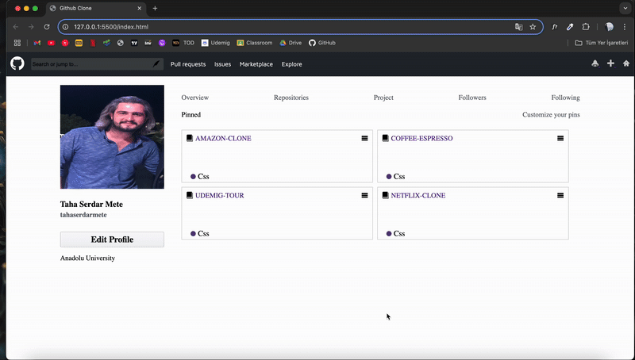

# Github Clone

This project is a GitHub user profile interface clone built with modern SCSS. The design is modular, facilitating project management and scalability with SCSS features such as variables, subdivisions, and mixins.

# Technologies Used

- Html
- Css
- Scss

# Screenshot

